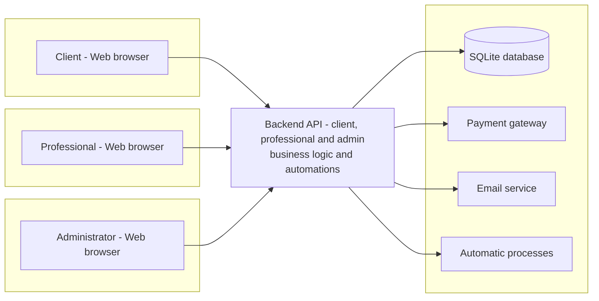

# Initial Architecture Sketch

The platform will follow a classic **three-layer web architecture**:

1. **Client layer (frontend)** – Web browser used by professionals and clients.
2. **Server layer (backend / REST API)** – Python application (Flask or FastAPI).
3. **Data layer** – SQLite database.
4. **External services** – Payment gateway and email service.

---

## Client layer (frontend)

- Web application accessible from the browser.
- Built with **HTML, CSS and JavaScript**.
- Serves both **professional** and **client** views:
  - Professionals access their dashboard (services, schedule, appointments).
  - Clients access the public profile and booking form.

The frontend communicates with the backend through **HTTP requests** to the REST API.

---

## Server layer (backend / REST API)

- Implemented in **Python** using **Flask** or **FastAPI**.
- Exposes several **REST endpoints** for:
  - Professional authentication.
  - Service and availability management.
  - Querying available time slots.
  - Creating, updating and cancelling appointments.
  - Integrating with the payment gateway.
- The backend will include internal modules such as:
  - Scheduling / calendar management module.
  - Payments module.
  - Notification module (email sending).

These are **internal components**, not external actors.

---

## Data layer (database)

- **SQLite** database (sufficient for this academic project).
- Only the backend accesses the database directly.
- Typical tables will include:
  - Professionals and clients.
  - Services.
  - Availability and generated slots.
  - Appointments and their status.
  - Payments (references to the payment gateway).

In future stages the project could migrate to another database engine (e.g., PostgreSQL).

---

## External services

- **Payment gateway** (Stripe or PayPal in test mode):
  - The backend calls the payment API or redirects the user.
  - The gateway returns a success / error status that is stored in the system.
- **Email service**:
  - Used by the notification module to send:
    - Confirmation emails.
    - Appointment reminders.
    - Change / cancellation notices.

---

## Architecture diagram (preliminary)

Simplified diagram of the communication between components:

