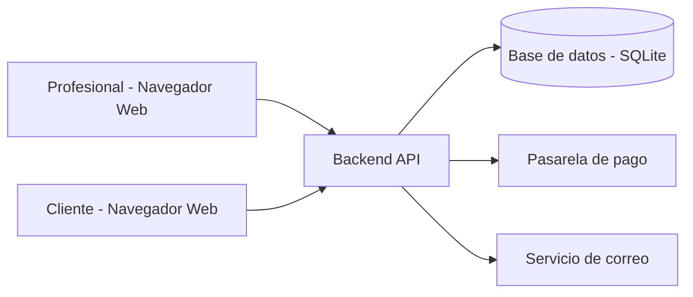

# Boceto inicial de la arquitectura

La plataforma seguirá una arquitectura web clásica de **tres capas**:

1. **Capa cliente (frontend)** – Navegador web del profesional y del cliente.
2. **Capa servidor (backend / API REST)** – Aplicación en Python (Flask o FastAPI).
3. **Capa de datos** – Base de datos SQLite.
4. **Servicios externos** – Pasarela de pago y servicio de correo.

---

## Capa cliente (frontend)

- Aplicación web accesible desde el navegador.
- Desarrollada con **HTML, CSS y JavaScript**.
- Se adapta tanto al **profesional** como al **cliente**:
  - El profesional accede a su panel (servicios, agenda, citas).
  - El cliente accede a la página pública del profesional y al formulario de reserva.

El frontend se comunica con el backend mediante **peticiones HTTP** a la API (REST).

---

## Capa servidor (backend / API REST)

- Implementada en **Python** con **Flask** o **FastAPI**.
- Expondrá una serie de **endpoints REST** para:
  - Autenticación de profesionales.
  - Gestión de servicios y disponibilidad.
  - Consulta de huecos disponibles.
  - Creación, modificación y cancelación de citas.
  - Integración con la pasarela de pago.
- Dentro del backend se incluirán módulos internos como:
  - Módulo de gestión de agenda.
  - Módulo de pagos.
  - Módulo de notificaciones (envío de correos).

Estos módulos internos no son actores externos, sino componentes de la lógica del servidor.

---

## Capa de datos (base de datos)

- Base de datos **SQLite** (suficiente para el TFG).
- El backend será el único que acceda directamente a la base de datos.
- De forma orientativa, se gestionarán tablas para:
  - Profesionales y clientes.
  - Servicios.
  - Disponibilidad y huecos generados.
  - Citas y estado de cada una.
  - Pagos (referencias a la pasarela).

En fases posteriores podría migrarse a otro motor (por ejemplo, PostgreSQL) si el proyecto creciera.

---

## Servicios externos

- **Pasarela de pago** (Stripe o PayPal en modo test):
  - El backend redirige o llama a la API de pago.
  - La pasarela devuelve un resultado (éxito / error) que se registrará en el sistema.
- **Servicio de correo**:
  - Usado por el módulo de notificaciones para enviar:
    - Correos de confirmación.
    - Recordatorios de cita.
    - Avisos de cambio o cancelación.

---

## Diagrama preliminar de arquitectura

Diagrama simplificado de la comunicación entre elementos:

